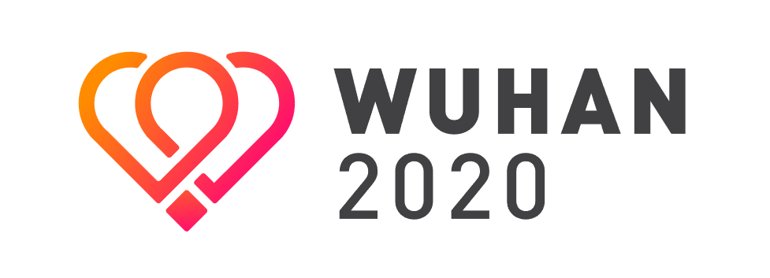

# wuhan2020 お知らせ 2020.1.29

wuhan2020の皆さん、ご協力誠にありがとうございます。このプロジェクトは武漢の自己組織化されたレスキュー活動をより、効果的かつ正確にするため、オープンソース情報共有プロジェクトを共同で構築したいと考えて成立しています。

**現在、我々の目標は：（１）病院、工場、調達や、様々の情報を集めて社会に同期データサービスを作成して（２）ウイルスとの戦いに貢献したいすべての人々を招集し、関連するスキルを持つ全員ができるようにすることです。**

プロジェクトWeb入り口：新型コロナウイルスイインフォメイションフォルム [https://wuhan2020.kaiyuanshe.cn](https://wuhan2020.kaiyuanshe.cn) 

## 一、協力方法：オープンソースコラボレーション

現在、我々は2000人以上のボランティアを募集してきました。ご支援をいただき、誠にありがとうございます。

共同作業のプロセスでは、階層管理モデルを採用せず、すべての人が平等であり、物事を通じて一緒に組織されます。 これもオープンソース（Open source Collaboration）の大事な1つ：「**貢献は役割を決定します**」。 誰もが役割を引き受け、責任を果たします。能力が強いほど、支払い意欲が高くなり、より多くの仕事を引き受けます。各個人の具体的な貢献は、コミュニティ全体に透明になり、コミュニティ全体によって評価されます。

今回の事件によって生成された要件に関連する特別な適時性のために、完全にモデルに従ってプロジェクトに協力することはできず、品質と適時性を確保するために何らかの介入管理を実行します。この点は理解できることを願っています。

## 二、プロジェクトの進展と資源について

### プロジェクト構造図

ソースページ：  [https://github.com/wuhan2020/data-sync](https://github.com/wuhan2020/data-sync)

### 資源とプロジェクト

| プロジェクト | URL       | 所属组      | 介绍                  |
| --- | ------------- | ---------- | -------------------- |
| プログレッシブ WEBアプリケーション(Progressive Web Apps, 以下PWA) | https://github.com/wuhan2020/WebApp           | [#proj-front-pages](https://wuhan2020.slack.com/archives/CSTPXN533) | https://wuhan2020.kaiyuanshe.cn/ フロントエンドのコード |
| 数据同步    | https://github.com/wuhan2020/data-sync        |[#proj-datasync](https://app.slack.com/client/TT5U1VCPQ/CT4AV807P)|                                        |
| API サーバー | https://github.com/wuhan2020/api-server       | [#proj-api-server](https://wuhan2020.slack.com/archives/CT3V5CDKJ) |               |
| 地図上のデータ可視化                                         | https://github.com/wuhan2020/map-viz | [#team-backend](https://app.slack.com/client/TT5U1VCPQ/CT6HW3X8E) |        |
| [石墨表格](https://shimo.im/)同期コンポーネント | https://github.com/wuhan2020/shimo-sheet2json | [#team-backend](https://wuhan2020.slack.com/archives/CT93MCEJK) ||
| UIドキュメント | https://shimo.im/docs/6PtqQkXvJjCYwdwj | [#team-designer](https://wuhan2020.slack.com/archives/CT70SHJQ0) |  |
| PRDドキュメント | https://www.figma.com/file/6oLZ4Swo2He0w8DUNELsUV/wuhan?node-id=0%3A28 | [#team-requirement-management](https://wuhan2020.slack.com/archives/CT99VDWS2) | 製品設計書 |

ソースページ：[https://github.com/wuhan2020/wuhan2020/](https://github.com/wuhan2020/wuhan2020/) 

## 三、プロジェクトの申請、承認、管理

我々は今回のウイルス対抗をサポートして、コアデータプロジェクトを開発し、さまざまな能力を備えたボランティアプールを提供します。開発者は今回の状況を対応するプロジェクトの開発は全て歓迎します。たとえば、ボランティアがいくつかの新機能の開発に興味がある場合、プロジェクトチームを自分で設定し、チームメンバーを個別に募集して開発するのもできます。コアチームのメンバーはプロジェクトの品質と結果を監督します。

### 1、プロジェクトの申請、承認

コアチームの仕事は

ボランティアを招集し、プロジェクトの全体的な方向性とリスク回避を管理および監視することです。開発者は新しいプロジェクトを立ち上げる場合、新しいGitプロジェクトを作成して開発してください。

コアメンバーはプロジェクトの評価を実施して承認する場合、承認されたプロジェクトはプロジェクトプラットフォームに分岐するか、プロジェクトプラットフォーム上で直接新しいものを作成し、それに対応する権限を開きます。

現在、公式のGithub linkは：http://github.com/wuhan2020 。もし新しいGithub プロジェクト組を作成する場合、コアメンバーを連絡して権限はを要求してください。プロジェクト申請するため、プロジェクトの名前および目的と機能などのインフォメイションを提供してください。

[Githubプラットフォーム](https://github.com/wuhan2020)に正式に参加したプロジェクトについては、対応する宣伝を提供し、公式のボランティアプールにプロジェクトに参加する人員の選択を支援できます。プロジェクトがメンテナンスや不適切な情報（コマーシャル、広告、リーク、国にとって好ましくないなど）を完全に停止した場合、プロジェクトを削除することを検討します;プロジェクトがうまくいかない場合、対応するプロモーション、技術を提供します、管理および人事。

### 2、各项目组和沟通

- 主要な技術的討論はSlackに行われています。ボランティアチームに参加したい場合は、まず[Slack](https://join.slack.com/t/wuhan2020/shared_invite/enQtOTI2NTU1NzU3MTM2LWQ1YjIzMDllYjYzYTE1OTNhMWU4OTZkOGYzOGJhOWM2MzdlMjgwMmZiOWEzYTQwNmJkZDI4OWRmM2Q2ZDM1MTc)に参加して、スキルに対応して興味のある [`channel`](https://github.com/wuhan2020/wuhan2020/blob/master/README_JP.md#slack-%E4%BA%A4%E6%B5%81%E3%82%B0%E3%83%AB%E3%83%BC%E3%83%97)をフォローしてください。
- `Github`はの開発のプラットフォームで、主に技術グループが参加し、`issue`や`pr`などの関連コンテンツは[Slack](https://join.slack.com/t/wuhan2020/shared_invite/enQtOTI2NTU1NzU3MTM2LWQ1YjIzMDllYjYzYTE1OTNhMWU4OTZkOGYzOGJhOWM2MzdlMjgwMmZiOWEzYTQwNmJkZDI4OWRmM2Q2ZDM1MTc)の対応するプロジェクトチャネルに同期されます

各グループの機能はそのslack channelを対応しています。

#### 1) 現在 `channel` 一覧

- [`#general`](https://wuhan2020.slack.com/archives/CSTGKFRCH) ——   `Slack` デフォルトの`channel`、そしてお知らせの `channel`：管理員だけ内容を発表します。この`channel`で他の内容を発表するのは禁止です。公式の最新情報、他の`channel`の重要な事件、メンバ集め、任務などの重要なインフォメーションを発表します。

#####  A,  `team-主スキル-子スキル`の命名フォマット————開発 `channel`，メンバーを募集するため、同じのスキルをもつ開発者を集めます。もし同じスキルを持つ、特定な任務を探している場合、対応の`channel`をフォーロしてください。現在の`channel`は：

- [`#team-designer`](https://wuhan2020.slack.com/archives/CT70SHJQ0)————デザインナー組
- [`#team-requirement-management`](https://wuhan2020.slack.com/archives/CT99VDWS2)————製品要件を管理する組
- [`#team-frontend`](https://app.slack.com/client/TT5U1VCPQ/CT93L48H5)————フロントエンド開発組
- [`#team-backend`](https://wuhan2020.slack.com/archives/CT93MCEJK)————バックエンド開発組
- [`#team-data`](https://wuhan2020.slack.com/archives/CSX1LGEKD)———-----—データサイエンス組
- [`#team-translation`](https://wuhan2020.slack.com/archives/CTAJA3L9M)————翻訳組（英語、日本語、イタリヤ語、韓国語......）
- [`#team-overseas`](https://app.slack.com/client/TT5U1VCPQ/CTAM5R65U)————海外（中国以外）の地域で参加するボランティアの連絡、および資源の整合するための`channel`

#####  B,    `proj-プロジェクト-技術スタック`命名フォマット————プロジェクト组 `channel`， `GitHub`のプロジェクトに関するインフォーメーションを同期し，各プロジェクトの専門的な交流をします。プロジェクトを参加するボランティアはぜひフォローしてください。現在の`channel`は：

- [`#proj-operation`](https://wuhan2020.slack.com/archives/CSX1X74M9)————日常運営組。このプロジェクトの自己組織化のを監督するため、ボランティアを募集して他の`channel`の管理をする。技術的に`GitHub`のプロジェクトを討論しません。主に：新人のガイド、Slack各`channel`の管理、各`channel`の日常インフォメーションを同期し、有効・関連内容を収集し、`channel`内の討論をガイドそして管理する（広告や無関係な内容を消すこと）。本組を参加するのはぜひオンライン時間を保証してさい。お互いに鼓動と監督をしてください。
- [`#proj-datasync-eggjs-ts`](https://wuhan2020.slack.com/archives/CT4AV807P)————コアデータ同期のプロジェクト。開発者は直接任務を取って開発するのは可能です： http://github.com/wuhan2020/data-sync 。目标は全てのデータをGitHubに同期して、フロントエンド開発組に提供することです。今回のデータは[石墨](https://shimo.im/)で管理する。登録を失敗するときには`channel`にご相談してください。
- [`#proj-front-pages`](https://wuhan2020.slack.com/archives/CSTPXN533) フロントエンドプロジェクト組
- [`#proj-api-server`](https://wuhan2020.slack.com/archives/CT3V5CDKJ) フロントエンドプロジェクトに統一されたデータインターフェイスを提供する組

#####  C,    `help-项目名`命名格式————相关建议和帮助组 `channel`，目的是对相关项目的 Q&A 已经建议。设置该组是为了避免大量无关信息干扰项目组的交流沟通。

- [`#help-advisement`](https://app.slack.com/client/TT5U1VCPQ/CT7AABP53)————公式のご要望および資源を提供する`channel`です。　是官方的建议征求频道，欢迎大家进入该频道，给组织者提供宝贵建议。

#####  D, `data-项目名`命名格式————数据录入组 `channel`，希望参与相关数据录入工作的志愿者，欢迎关注。目前已有：

- [`#data-clinic`](https://app.slack.com/client/TT5U1VCPQ/CT4CQTZQ8) 無料医者相談データ
- [`#data-donation`](https://app.slack.com/client/TT5U1VCPQ/CT4DCTVSR) データを寄付する
- [`#data-factory`](https://app.slack.com/client/TT5U1VCPQ/CT3UT3HFE) （相関資源生産する）ファクトリデータ
- [`#data-hospital`](https://app.slack.com/client/TT5U1VCPQ/CT4CPP1H6) 病院データ
- [`#data-hotel`](https://app.slack.com/client/TT5U1VCPQ/CT4CPSFEU) ホテルデータ

#### 2) `Channel`を作成する

「**最初の申請者が最初に自己組織化**」の原則に基づいて、誰でも新しい`channel`を自由に申し込むことができ、上記の形式に従って名前を付けて提出する必要があります。関連するすべての質問とチャンネルの許可については、「Slack」の「@Frank Zhao」および「@David Z.」にお問い合わせください。重複した`channel`が存在する場合、マージすることは可能です。

`Github`はの開発のプラットフォームで、主に技術グループが参加し、`issue`や`pr`などの関連コンテンツは[Slack](https://join.slack.com/t/wuhan2020/shared_invite/enQtOTI2NTU1NzU3MTM2LWQ1YjIzMDllYjYzYTE1OTNhMWU4OTZkOGYzOGJhOWM2MzdlMjgwMmZiOWEzYTQwNmJkZDI4OWRmM2Q2ZDM1MTc)の対応するプロジェクトチャネルに同期されます。ボランティアチームに参加したい場合は、まず[Slack](https://join.slack.com/t/wuhan2020/shared_invite/enQtOTI2NTU1NzU3MTM2LWQ1YjIzMDllYjYzYTE1OTNhMWU4OTZkOGYzOGJhOWM2MzdlMjgwMmZiOWEzYTQwNmJkZDI4OWRmM2Q2ZDM1MTc)に参加して、興味のある[`channel`](https://github.com/wuhan2020/wuhan2020/blob/master/README_JP.md#slack-%E4%BA%A4%E6%B5%81%E3%82%B0%E3%83%AB%E3%83%BC%E3%83%97)をフォローしてください。

皆様の無私の努力に誠に感謝いたします。山川异域，风月同天。この戦いは必ず、勝！

**このページは、新規参入者を導き、リソースを管理する**ためのプロジェクトへの入り口です。新規参入者を便利に提供するため、ここで最新のステータスを更新するように各グループにご依頼申し上げます。

* [Githubでこの原稿を変更](https://github.com/wuhan2020/wuhan2020.github.io/)
* [ご意見ご要望について ](https://github.com/wuhan2020/wuhan2020.github.io/issues/new)

