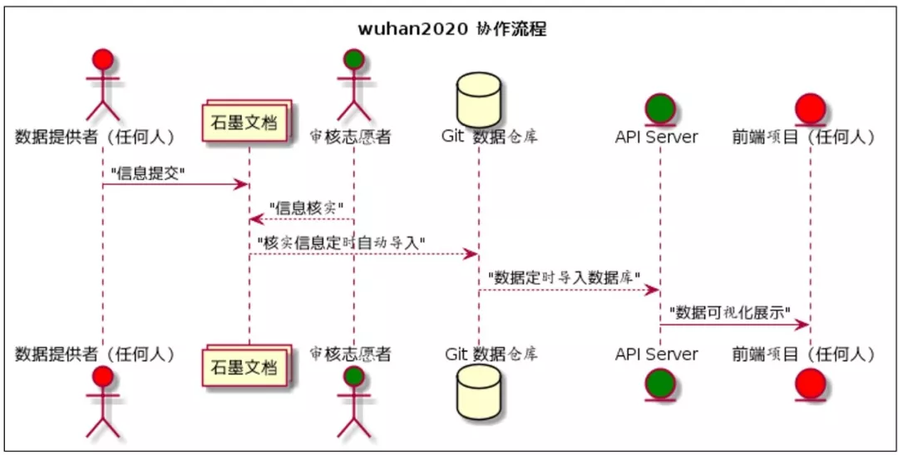
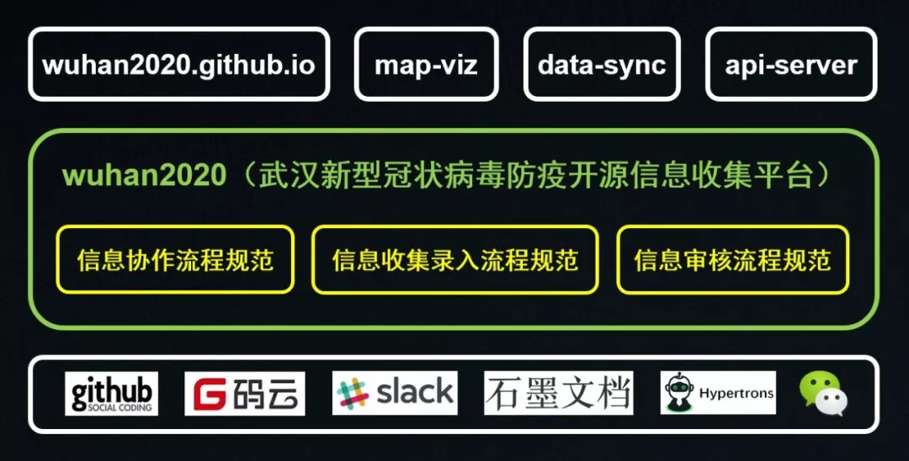
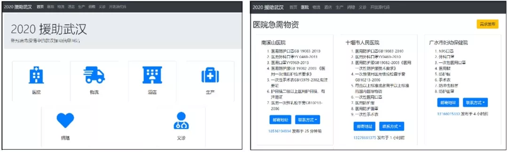

# 致 WUHAN 2020 开源社区全体成员的一封信

各位wuhan2020 开源社区成员：

2020年1月25日，春节，在这个特殊的日子，我们正式发起了《[wuhan2020](http://mp.weixin.qq.com/s?__biz=MzA5MTc0MzEzNQ==&amp;mid=2672493489&amp;idx=1&amp;sn=5e416af1ca475b2b4efdbdc1ee0162ba&amp;chksm=8ac81541bdbf9c571831d05340bdf2bbe125917f143b4176d3de5000c51574cb7827ad192bf3&amp;scene=21#wechat_redirect)[：武汉新型冠状病毒防疫开源信息收集平台](http://mp.weixin.qq.com/s?__biz=MzA5MTc0MzEzNQ==&amp;mid=2672493489&amp;idx=1&amp;sn=5e416af1ca475b2b4efdbdc1ee0162ba&amp;chksm=8ac81541bdbf9c571831d05340bdf2bbe125917f143b4176d3de5000c51574cb7827ad192bf3&amp;scene=21#wechat_redirect)》的开源项目，用开发者们的方式支援这场没有硝烟的战争。截至2020年1月28日21时，全国共有4630个确诊病例、73个治愈病例、以及106个死亡病例，海外60个确诊病例，形势异常严峻。

## 缘起

项目之初，我们看到的是，面对突如其来的新型冠状病毒疫情，武汉及周边各市县均爆出物资供给不足的情况，而重大公共卫生事件在公共社会事件中属于较复杂的类型，统筹安排难度大，周期长。而且，目前信息采集与公布平台不一致，信息散乱很难进行有效沟通，大量图片信息不利于实时沟通。

作为开发者群体，我们思考的是能否利用数字平台优势，让各供需方进行分布式自助对接可大幅提升效率。故发起该项目，旨在统一收集本次事件中相关事务处理方的信息，并利用开源和分布式协作优势实时更新并通报，提供各方的联系平台。这里，供需数字化和信息的透明快速扭转是我们认为的关键所在。

事实上已有相似的石墨文档项目发起，保持在 50 人左右的协同编辑热度，但石墨文档编辑的方式，很难保证格式一致性，需要有专人实时对内容格式进行编辑，各种标注较为混乱，而且对于后期加入程序可视化与交互能力并不友好。正好我们又是一群开源爱好者，故直接在GitHub 上发起了该项目，望众程序员可以齐心协力，共克时艰。

## 项目功能

旨在统一收集本次事件中相关事务处理方的信息，并利用开源和分布式协作优势进行实时更新并通报，提供各方联系的综合平台，其核心是通过公开众包的形式进行采集数据，同样通过众包审核后，将带有数据来源的信息合并到代码仓库中，并形成一套完整的流程机制。

在项目初期，其实我们并没有仔细思考整个平台的功能，特别是从产品的角度，这也受限于团队本身。我们首先制定了几件容易想到的事情，包括：

* 存储格式：标准的csv文件

* 信息主体：医院信息、酒店信息、物流信息、生产信息、捐赠信息、捐款信息、预防治疗手段、新闻内容等

* 信息实时录入功能

* 部分可视化与信息查询界面

* 外部数据汇集：微博、头条、搜索引擎信息等

在项目开始实施后，我们开始遇到了一些问题，同时也总结了部分经验，具体如下。

## 遇到的挑战

* 工作量大，累成狗，很多信息需要挨个打电话落实

* 网上流传的有些信息被篡改，不知道群里的数据本身是不是被篡改

* 我验证的信息，别的小分队、组织也在验证，重复劳动

* 甚至有个硬要求：只把官方发布的数据算进去

* 医院内部的信息可能数据贡献者跟发布者没有同步

* 数据的时效性无法保障

* 如何避免跟其他群或者组织重复验真

* 如何将其他组织的数据变成可信任的数据源

* 信息收集渠道不统一，多种工具同时在用

## 总结的经验

* 流程、流程、流程：流程是规范大家行为，保证每个人的行动一致、结果的偏差小

* 数据输入和验证漏斗：搜集—验真—录入—发布

* 与公开信息交叉验证

* 医院汇总人员直接录入，可信程度最高，同时带上录入员信息

## 重新顶层设计

基于上述挑战和经验，我们重新进行了顶层设计，并把中心放在标准的流程和标准的录入规范上面，同时继续用石墨工具进行统一信息采集。这里要重点提一下石墨团队，直接拉了主力开发人员协助我们进行数据接口的对接。探索中，我们逐步形成了如下的协作流程：

持续更新，以Github上的为准

目前我们设计的 《信息协作流程规范》 中，信息流程如下：

 石墨表格 --> Git 数据仓库 --> 前端展示 

其中，石墨流程包括：

* 任何人可以填写申请表单，获得某类信息的录入权限

* 信息录入有格式要求，通过石墨公式进行强校验

* 录入信息需要有源链接，提供有效的数据校验能力

* 审核人有严格的制度，审核人信息实名落地，保证不会有恶意审核

* 石墨文档中，申请并通过的账号有录入权限，但表头与审核状态列只有审核人可以编辑

* 审核人在审核确定某条记录真实后，会锁定该行，不能再进行编辑

* 对于数据重复校验，使用石墨的重复数据自动高亮功能提示，并提供脚本的定时检查能力

数据落仓包括：

* 石墨数据可以自动化落入Git 数据仓库

* 通过配置方式决定哪些文档数据可以落仓

* 落仓时仅落入已经审核通过的数据，未通过数据不予落仓

* 落仓无需二次校验，直接推入数据仓库

* 落仓由程序自动化进行，保证数据实时性不会高于 15 分钟的误差

* 落仓时会进行额外的数据预处理，方便后续处理

* 对于特定行，例如特定医院记录，邀请联系人成为该行数据编辑人，仅能编辑本医院条目，其他类别类似

数据展示包括：

* 数据仓库包含各种数据类型的实时数据

* 任何开发者可自行开发可视化展示、检索、分析程序，直接使用线上数仓数据

通过以上流程，采取分组制，流水线作业，好处是：

* 操作行为可控，能收敛

* 严格用核心成员保证审核人的来源，保证了数据录入有效性，所有数据必须经过实名审核员审核

* 保证自动化程度，保证后期的大规模水平扩展能力，除数据审核外全流程数据落地全部自动化，无需人工介入

* 保证数据有效性，数据审核后锁定，除数据源负责人，无人可进行修改

* 保证数据时效性：该条需要该平台首先成为唯一数据源平台，则数据源负责人在需求变动时仅需修改表单对应行即可

* 数据是实时变化的，而且由于使用的是Git 数仓，其实我们可以拿到所有的历史变化记录，便于数据分析工作

基于上述思想，我们形成了《信息收集录入流程规范》，录入组必须遵循这样的规范才能录入信息；同样，我们也形成了《信息审核流程规范》，审核员也必须按照该规范才能进行数据落仓。

我们希望通过自动化手段来聚集数据，当其成长为主要平台时，各数据源自然会来我们这里发布和修改数据，而我们的<四层权限体系也保证了数据的真实有效。当然最重要的全流程的自动化，以保证在<水平扩展时不会导致人力成本爆炸。我们技术团队的主体来自高校的老师和学生，集中在计算机专业和数据分析专业，全流程管理和自动化一开始就都在考虑之列的。

我们的初衷是帮助整合信息，让大家能够快速获取有效实时的数据和信息，这个初心是不变的。我们同时也还有自己的学业和事情，也不是非要做成一个重要的项目，如果有别人做的比我们好，自然是应该学习的，但如果我们觉得我们的方式更好，那我们就应该坚持做下去再看结果，这就是开源的核心所在。

长远看，我们的项目可以快速发展，对接任意数据源、任意数仓、任意数据格式，三个解耦，使得其有很好的扩展能力。最理想的情况是，官方直接用我们的数据平台进行数据录入，即保证了高效性，也保证了数据的真实性。当然，这需要我们共同来努力，使其成为一个最有影响力的平台，直接的信息源实名录入，是我们最想看到的结果。

基于上述思想，项目目前的形态架构大致是下面这个样子（并不严谨版）：

 

持续更新，以Github上的为准

中间的三个规范是我们最重要的核心，也是希望能够持续迭代成为全网标准，目前共包括三个规范：《信息协作流程规范》、《信息收集录入流程规范》、以及《信息审核流程规范》，相信随着项目的不断推进，还会有更多更加细致的规范出来。

最下面一层是我们整个开源社区目前正在使用的基础设施。其中 **GitHub** 和码云用来做开发协作与数据落地，出于数据安全的考虑，最终的数据落地会是在码云平台上，协作流程目前还是在GitHub上的原因是GitHub的协作生态要好太多（懂的人自然懂），特别是集成了我们自己的协作机器人 **Hypertrons** 。当然，后续也不排除某个合适的时间，我们也同时支持码云平台的协作。 **Slack** 是我们开发者日常交流通信的工具，即ChatOps，为什么不用微信，同样也是懂的人自然懂，类似Slack这样的工具对于开发者来说太重要，大家可以多尝试。

而对于非技术人员来说（信息采集、审核、宣传、协调等），则主要是通过石墨文档来进行信息采集与审核，通过微信来进行日常的沟通交流。也正是因为此，我们逐渐形成了多个小分队，并实行组长责任制。

最上层是基于本项目落地的数据平台的各种应用，包括数据门户、数据可视化、数据同步等，相信随着项目的推进，还会有更多有意思的应用出现。

  

持续更新，以https://github.com/wuhan2020为准

## 社区组织

wuhan2020开源社区目前包括如下几个组：

* 技术组：项目工程技术实时团队，目前主要通过Github + Slack进行协作；

* 信息组：目前主要负责信息的收集与录入，主要工具为石墨文档；

* 协调组：协调几个小组之间的协同与协作。

这是最开始形成的三个核心小组，到了第三天和第四天，我们又形成了三个新的小组：

* 宣传组：对项目进行宣传，包括品牌的建设，文案、设计等宣传资料的制作，以及渠道的拓展；

* 审核组：根据审核规范对录入的信息的真实性进行审核；

* 风控组：对项目整体风险进行控制，包括信息安全风险、合规性等方面。

之所以增加风控组，我们认为除了数据的真实性，数据的安全性问题同样重要，合法合规同样是我们必须遵守的，也请所有正在做贡献的朋友们引起重视。因此，再次声明一下：本项目所收集的数据均是通过正规渠道通过公开众包的形式进行采集的，通过众包审核后，均附有数据来源，项目本身的核心是提供一套流程机制和规范，尽量发动志愿者、合作方、甚至是官方来进行数据采集的动作，并且坚持知情同意的原则。

在上面工作小组的基础之上，我们形成了《 **wuhan2020** 入组工作攻略》，这样，新来的朋友们可以更具自己的特长，选择加入的工作组进行工作，包括加入渠道，小组负责人等信息。

## 关于开源

最后再来聊聊开源的一些事情。开源首先是我们团队的专业技术爱好和一种高效工作方式的共识。而在当下这个灾难场景下又有一层特别的含义，那就是数据开源。我们认为，正是因为相关部门数据的不开放、流转不透明，才导致了今天这样一个困局。而数据的使用方式也应该是开源的，这就涉及到软件开源了，不仅是使用方式，整个软件的构建过程也同样应该开放透明，这就是协作开源了。短短的几天，我们已经深刻体会到这种开发模式的威力，正所谓开源界一天， **IT** 界一年。我想整个社区的开发者也会慢慢有我们类似的体会。而且会由量变带来质变，那就是公平度与自由度！

今天，得益于全人类共同的实践成果，使得我们能够以一个更加平等的方式重新组织社会、重新安排生活。这种组织与安排不仅发生在我们的现实社会中，还进一步渗透到了我们的数字空间中，并通过互联网进行了放大与加深。

今天的开源界，非常像当年的美洲新大陆。广大的开发者们正在共同开拓一个新的开源数字生态，而发源于计算机工程领域的开源正在从专业领域走向普通大众、从技术工程走向科学想象、从社区治理走向与社会科学与人文科学的结合，甚至需要进行人类学式的文化研究。

我们希望这个开源项目与开源社区，承载的不仅仅是这次肆虐的病毒抗争，同时还是一次开源社会实验，通过聚集全球的协作者，形成共识，战胜苦难，解决全人类所面临的难题。

**wuhan2020开源社区共同体**

**2020年1月28日**

## 相关文档：

《wuhan2020入组工作攻略》：

https://shimo.im/docs/tQ8Phx3KdgkHDR8y/read

《信息收集录入流程规范》：

https://shimo.im/docs/v3xCCYVWhtHvq9w8/read

《信息审核流程规范》：

https://shimo.im/docs/jRQdGwqjwdPVqJpG/read

 

Scan with WeChat to
follow the Official Account